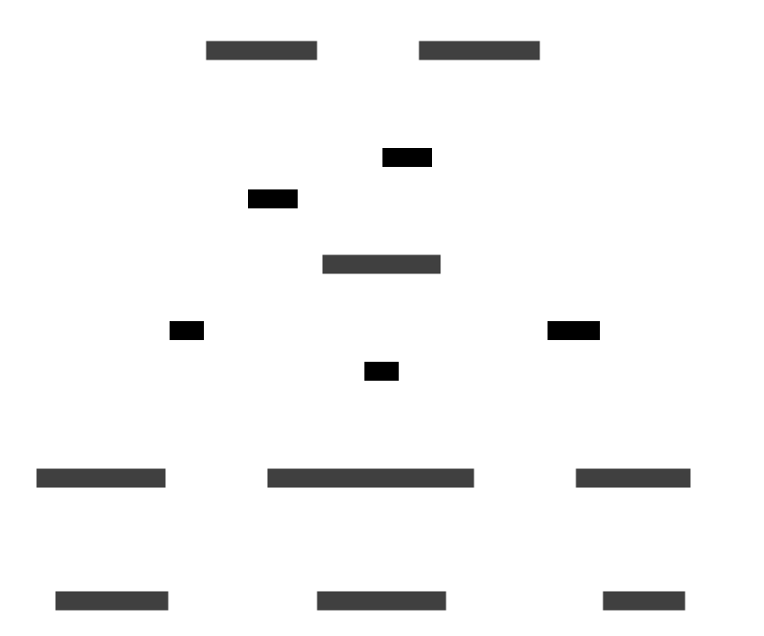
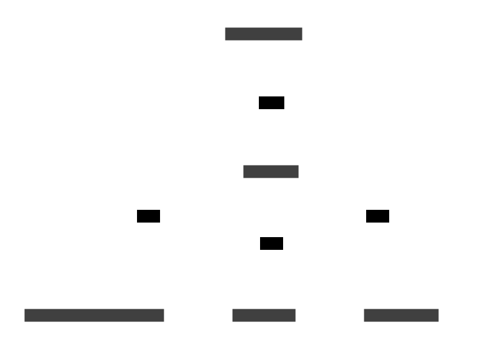

# Message Flow

## Table of Contents

- [Context](#context)
- [Services](#services)
  - [Campaign Service](#campaign-service)
  - [User Service](#user-service)
- [Channels](#channels)
  - [campaign.analytics](#campaignanalytics)
  - [campaign.create](#campaigncreate)
  - [campaign.execute](#campaignexecute)
  - [campaign.status](#campaignstatus)
  - [notification.preferences.update](#notificationpreferencesupdate)
  - [notification.user.{user_id}.push](#notificationuseruseridpush)
  - [user.analytics](#useranalytics)
  - [user.info.request](#userinforequest)
  - [user.info.update](#userinfoupdate)
- [Changelog](#changelog)

## Context


## Services

### Campaign Service

A service that manages notification campaigns, user targeting, and campaign execution.
Handles campaign creation, user segmentation, scheduling, and personalized notification delivery.
Uses user data for targeting and personalization of campaign messages.




### User Service

A service that manages user information, profiles, and authentication.
Handles user data requests, profile updates, and user lifecycle events.




## Channels

### campaign.analytics


#### Messages
**CampaignAnalyticsEventMessage**
```json
{
  "campaign_id": "string[uuid]",
  "event_id": "string[uuid]",
  "event_type": "string[enum:campaign_created,campaign_executed,notification_sent,notification_opened,notification_clicked,campaign_completed,campaign_failed]",
  "execution_id": "string[uuid]",
  "metadata": {
    "environment": "string[enum:development,staging,production]",
    "platform": "string[enum:ios,android,web]",
    "source": "string[enum:mobile,web,api]",
    "version": "string"
  },
  "notification_id": "string[uuid]",
  "timestamp": "string[date-time]",
  "user_id": "string[uuid]"
}
```

### campaign.create


#### Messages
**CampaignCreateMessage**
```json
{
  "campaign_id": "string[uuid]",
  "created_at": "string[date-time]",
  "description": "string",
  "metadata": {
    "environment": "string[enum:development,staging,production]",
    "platform": "string[enum:ios,android,web]",
    "source": "string[enum:mobile,web,api]",
    "version": "string"
  },
  "name": "string",
  "notification_template": {
    "body_template": "string",
    "data": "object",
    "localization": "object",
    "priority": "string[enum:low,normal,high]",
    "title_template": "string"
  },
  "schedule": {
    "recurring": {
      "end_date": "string[date]",
      "frequency": "string[enum:daily,weekly,monthly]",
      "interval": "integer",
      "start_date": "string[date]"
    },
    "scheduled_at": "string[date-time]",
    "timezone": "string",
    "type": "string[enum:immediate,scheduled,recurring]"
  },
  "settings": {
    "a_b_testing": {
      "enabled": "boolean",
      "traffic_split": [
        "number"
      ],
      "variants": [
        {
          "body_template": "string",
          "data": "object",
          "localization": "object",
          "priority": "string[enum:low,normal,high]",
          "title_template": "string"
        }
      ]
    },
    "batch_size": "integer",
    "max_retries": "integer",
    "rate_limit": "integer",
    "respect_quiet_hours": "boolean"
  },
  "target_audience": {
    "estimated_reach": "integer",
    "user_filters": {
      "language": [
        "string"
      ],
      "last_activity": {
        "from": "string[date-time]",
        "to": "string[date-time]"
      },
      "registration_date": {
        "from": "string[date]",
        "to": "string[date]"
      },
      "timezone": [
        "string"
      ]
    },
    "user_segments": [
      "string[enum:all_users,new_users,active_users,inactive_users,premium_users,free_users]"
    ]
  }
}
```

### campaign.execute


#### Messages
**CampaignExecuteMessage**
```json
{
  "batch_size": "integer",
  "campaign_id": "string[uuid]",
  "created_at": "string[date-time]",
  "execution_id": "string[uuid]",
  "execution_type": "string[enum:immediate,scheduled,batch]",
  "metadata": {
    "environment": "string[enum:development,staging,production]",
    "platform": "string[enum:ios,android,web]",
    "source": "string[enum:mobile,web,api]",
    "version": "string"
  },
  "priority": "string[enum:low,normal,high]"
}
```

### campaign.status


#### Messages
**CampaignStatusUpdateMessage**
```json
{
  "campaign_id": "string[uuid]",
  "error": {
    "code": "string",
    "message": "string"
  },
  "execution_id": "string[uuid]",
  "progress": {
    "failed": "integer",
    "sent": "integer",
    "success_rate": "number[float]",
    "total_targets": "integer"
  },
  "status": "string[enum:pending,running,completed,failed,paused,cancelled]",
  "updated_at": "string[date-time]"
}
```

### notification.preferences.update


#### Messages
**PreferencesUpdateMessage**
```json
{
  "preferences": {
    "categories": {
      "marketing": "boolean",
      "security": "boolean",
      "updates": "boolean"
    },
    "email_enabled": "boolean",
    "push_enabled": "boolean",
    "quiet_hours": {
      "enabled": "boolean",
      "end": "string[time]",
      "start": "string[time]"
    },
    "sms_enabled": "boolean"
  },
  "updated_at": "string[date-time]",
  "user_id": "string[uuid]"
}
```

### notification.user.{user_id}.push


#### Messages
**PushNotificationMessage**
```json
{
  "body": "string",
  "created_at": "string[date-time]",
  "data": "object",
  "notification_id": "string[uuid]",
  "priority": "string[enum:low,normal,high]",
  "title": "string",
  "user_id": "string[uuid]"
}
```

### user.analytics


#### Messages
**UserAnalyticsEventMessage**
```json
{
  "event_id": "string[uuid]",
  "event_type": "string[enum:user_registered,user_logged_in,profile_updated,preferences_changed,account_deleted]",
  "metadata": {
    "environment": "string[enum:development,staging,production]",
    "platform": "string[enum:ios,android,web]",
    "source": "string[enum:mobile,web,api]",
    "version": "string"
  },
  "timestamp": "string[date-time]",
  "user_id": "string[uuid]"
}
```

### user.info.request


#### Messages
**request**: UserInfoRequestMessage
```json
{
  "user_id": "string[uuid]"
}
```
**reply**: UserInfoReplyMessage
```json
{
  "email": "string[email]",
  "error": {
    "code": "string",
    "message": "string"
  },
  "language": "string",
  "name": "string",
  "timezone": "string",
  "user_id": "string[uuid]"
}
```

### user.info.update


#### Messages
**UserInfoUpdateMessage**
```json
{
  "changes": "object",
  "metadata": {
    "environment": "string[enum:development,staging,production]",
    "platform": "string[enum:ios,android,web]",
    "source": "string[enum:mobile,web,api]",
    "version": "string"
  },
  "updated_at": "string[date-time]",
  "user_id": "string[uuid]"
}
```

## Changelog

### 2025-07-26
- **added** service: 'Campaign Service' was added
